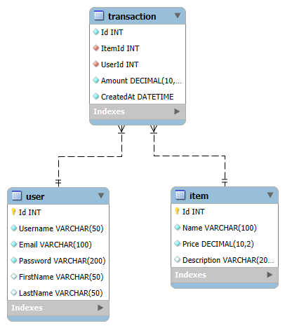

# Online Store Database

This is a simple database that mimics an online store, which stores information about users, items for sale,
and transactions. 

Tables were generated using the sql scripts found in [create-tables.sql](./create-tables.sql) and data was 
inserted using the scripts found in [insert-data.sql](./insert-data.sql). I used [DB.py](./DB.py) to set up the database
and run queries. [OpenAiUtils.py](./OpenAiUtils.py) was used to interact with the OpenAI API. Queries are automatically
formatted and written to [queries.sql](./queries.sql).

If you would like to run the code, you will need to set up a `config.py` file with the following variables:
```text
OPENAI_API_KEY = "YOUR_API_KEY"
MYSQL_USER = "YOUR_MYSQL_USERNAME"
MYSQL_PASSWORD = "YOUR_MYSQL_PASSWORD"
```

## Database Schema



## Successful Query

Prompt-Type: Zero-Shot

Prompt: Which items are my least productive?

Query:
```mysql
SELECT Item.Id, Item.Name, SUM(Transaction.Amount) AS TotalAmount
FROM Item
LEFT JOIN Transaction ON Item.Id = Transaction.ItemId
GROUP BY Item.Id, Item.Name
ORDER BY TotalAmount ASC;
```

DB Response:
```text
[[(3, 'Headphones', Decimal('199.99')), (2, 'Smartphone', Decimal('999.98')), (1, 'Laptop', Decimal('1999.98'))]]
```

Friendly Response: Laptop

## Unsuccessful Queries

Prompt-Type: Multi-Shot

Prompt: What is the most popular item?

Query:
```mysql
SELECT ItemId FROM Transaction GROUP BY ItemId ORDER BY COUNT(*) DESC LIMIT 1;
```

DB Response:
[[(1,)]]

Friendly Response: 1

Here, Chat-GPT was unable to infer that I wanted the name of the item, not the item ID.

---

Prompt-Type: Multi-Shot

Prompt: Which items are my least productive?

Query:
```mysql
SELECT Name FROM Item WHERE Id NOT IN (SELECT ItemId FROM Transaction);
```

DB Response:
```text
[[]]
```

Friendly Response: No items are identified as least productive.

Here, Chat-GPT thought that the least productive items were ones that had no transactions at all, which is not what I meant.
I wanted the items that had the least amount of transactions, which would have been Headphones.

Further examples of queries can be found in [queries.sql](./queries.md).

## Thoughts on different prompting strategies

### Zero-Shot

I actually believe that the zero-shot approach is the best for this task. Rather than providing examples of previous 
queries, allowing Chat-GPT to think more on how it should respond actually resulted in better queries. This can be seen with 
the difference in the successful query, "Which items are my least productive?" where the zero-shot query was able to
provide a good answer, while the single-domain query was not.

### Multi-Shot

As I stated before, for my specific task, the multi-shot approach was not as effective as the zero-shot approach.
I think that the model was being locked into a specific way of thinking when I provided examples of queries, which
resulted in less effective queries.

Here was the multi-shot query that I provided:

Prompt: What is the most that any user has spent in my store?
Query:
```mysql
SELECT MAX(total) FROM (SELECT SUM(Amount) AS total FROM Transaction GROUP BY UserId) AS t;
```

### Conclusion

I think that Chat-GPT 4o is a great tool for generating SQL queries when the user is not familiar with SQL. For my specific
case, the zero-shot approach was the most effective at generating queries that I wanted, as most if not all queries
that I provided as examples were not as effective as the zero-shot queries. 